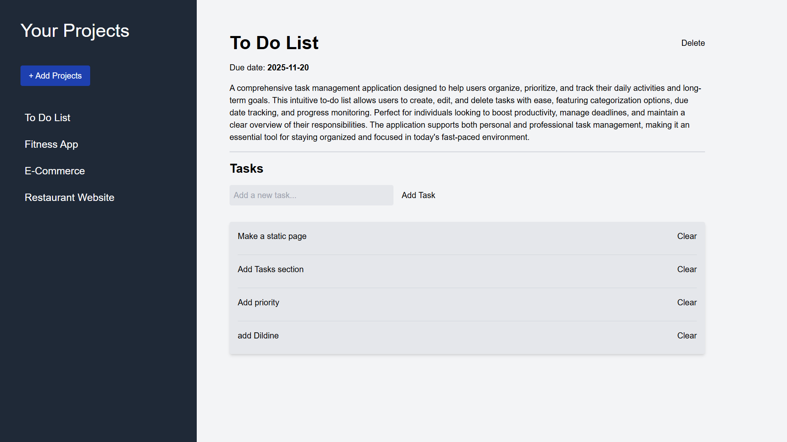

# 📋 Management App

A modern, intuitive project management application built with React and Tailwind CSS. Organize your projects, manage tasks, and boost your productivity with this sleek and responsive web application.

## 📷 Project Preview



## ✨ Features

- **📁 Project Management**: Create, edit, and delete projects with ease
- **✅ Task Tracking**: Add, remove, and organize tasks within each project
- **🎨 Modern UI**: Clean and responsive design with Tailwind CSS
- **📱 Responsive Design**: Works seamlessly on desktop and mobile devices
- **💾 Persistent Data**: Your projects and tasks are maintained throughout your session
- **🔄 Real-time Updates**: Instant updates when adding or removing items

## 🚀 Getting Started

### Prerequisites

Make sure you have the following installed on your machine:
- **Node.js** (version 14 or higher)
- **npm** or **yarn**

### Installation

1. **Clone the repository**
   ```bash
   git clone https://github.com/Eslamsaeed880/Management-App.git
   cd Management-App
   ```

2. **Install dependencies**
   ```bash
   npm install
   # or
   yarn install
   ```

3. **Start the development server**
   ```bash
   npm run dev
   # or
   yarn dev
   ```

4. **Open your browser**
   
   Navigate to `http://localhost:5173` to view the application.

## 🛠️ Built With

- **[React](https://reactjs.org/)** - A JavaScript library for building user interfaces
- **[Vite](https://vitejs.dev/)** - Next generation frontend tooling
- **[Tailwind CSS](https://tailwindcss.com/)** - A utility-first CSS framework
- **[PostCSS](https://postcss.org/)** - A tool for transforming CSS with JavaScript

## 📱 How to Use

### Creating a Project
1. Click the **"+ Add Projects"** button in the sidebar
2. Fill in the project details:
   - Project name
   - Description
   - Due date
3. Click **"Save"** to create your project

### Managing Tasks
1. Select a project from the sidebar
2. Use the task input field to add new tasks
3. Click **"Add Task"** to save the task
4. Use the **"Clear"** button next to each task to remove it

### Deleting Projects
1. Select the project you want to delete
2. Click the **"Delete"** button in the top-right corner
3. The project and all its tasks will be removed

## 📂 Project Structure

```
management-app/
├── public/
│   └── logo.png
├── src/
│   ├── components/
│   │   ├── AddProject.jsx    # Form for adding new projects
│   │   ├── EmptyPage.jsx     # Displayed when no projects exist
│   │   ├── Project.jsx       # Main project view with tasks
│   │   ├── Sidebar.jsx       # Navigation sidebar
│   │   └── Task.jsx          # Individual task component
│   ├── assets/
│   │   └── no-projects.png   # Empty state illustration
│   ├── App.jsx               # Main application component
│   ├── main.jsx             # Application entry point
│   └── index.css            # Global styles and Tailwind imports
├── index.html
├── package.json
├── tailwind.config.js
├── postcss.config.js
└── vite.config.js
```

## 🎨 Screenshots

### Main Dashboard

*The clean, organized interface makes it easy to manage your projects and tasks.*

### Project Management

*Simple interface for creating and managing projects with all necessary details.*

## 🤝 Contributing

Contributions are welcome! Here's how you can help:

1. **Fork the project**
2. **Create your feature branch** (`git checkout -b feature/AmazingFeature`)
3. **Commit your changes** (`git commit -m 'Add some AmazingFeature'`)
4. **Push to the branch** (`git push origin feature/AmazingFeature`)
5. **Open a Pull Request**

## 📝 License

This project is licensed under the MIT License - see the [LICENSE](LICENSE) file for details.

## 👨‍💻 Author

**Eslam Saeed**
- GitHub: [@Eslamsaeed880](https://github.com/Eslamsaeed880)

## 🙏 Acknowledgments

- Thanks to the React team for the amazing framework
- Tailwind CSS for the beautiful utility classes
- Vite for the lightning-fast development experience

## 📧 Contact

If you have any questions, feel free to reach out:
- GitHub Issues: [Create an issue](https://github.com/Eslamsaeed880/Management-App/issues)

---

⭐ **If you found this project helpful, please give it a star!** ⭐
